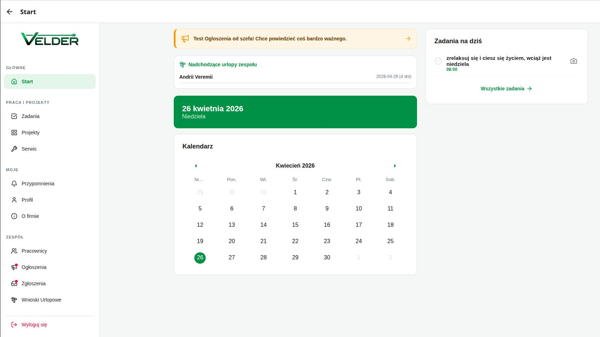
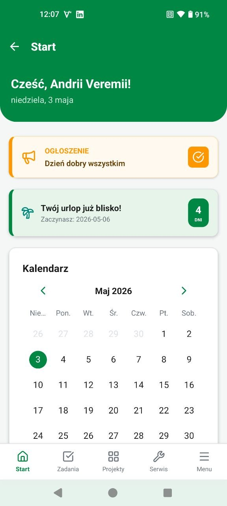

# Velder-soft 🏥🏗️

**Velder-soft** to dedykowany, zaawansowany system ekosystemowy stworzony dla lidera branży instalacji medycznych – firmy **Velder**. Aplikacja integruje procesy inżynieryjne, logistyczne i personalne, umożliwiając efektywne zarządzanie krytyczną infrastrukturą gazów medycznych w czasie rzeczywistym.

---

## 🏢 O Firmie Velder

**Velder** to marka z ponad **35-letnim doświadczeniem** na polskim rynku. Jako lider w swojej dziedzinie, firma specjalizuje się w dostarczaniu kompleksowych rozwiązań z zakresu systemów gazów medycznych, wspierając bezpieczeństwo pacjentów oraz standardy opieki zdrowotnej w setkach placówek medycznych.

### Specjalizacja i Misja

Głównym celem działalności jest budowanie i utrzymanie sieci gazów medycznych (tlen, azot, podtlenek azotu, powietrze medyczne). Misją Velder jest dostarczanie niezawodnego sprzętu oraz najwyższej jakości usług montażowych i serwisowych dla szpitali, klinik oraz ośrodków rehabilitacyjnych.

### Kluczowe Obszary Działania:

- **Projektowanie:** Tworzenie indywidualnych schematów instalacji dostosowanych do specyfiki budynków szpitalnych.
- **Montaż i Instalacja:** Profesjonalne wdrażanie stacji rozdzielczych, punktów poboru gazów, zaworów oraz przepływomierzy.
- **Serwis i Konserwacja:** Regularne przeglądy techniczne zapewniające bezawaryjną pracę systemów ratujących życie.
- **Edukacja:** Szkolenia personelu medycznego w zakresie bezpiecznej obsługi urządzeń gazowych.

🌐 **Dowiedz się więcej:** [velder.pl](https://velder.pl/)

---

## 📸 Prezentacja Systemu

|      Panel Zarządzania (Desktop)      |           Aplikacja Mobilna            |
| :-----------------------------------: | :------------------------------------: |
|  |  |

---

## 🚀 Możliwości Systemu Velder-soft

Aplikacja została zaprojektowana, aby przenieść 35 lat doświadczenia firmy w erę cyfrową:

- **Inteligentny Asystent Głosowy (AI Voice Parsing):** Tworzenie przypomnień za pomocą naturalnych komend głosowych. System automatycznie rozpoznaje daty, godziny i treść zadania.
- **Moduł Inteligentnych Urlopów:** System wnioskowania z żywym odliczaniem do wypoczynku oraz automatycznymi powiadomieniami (T-5 i T-1) dla pracownika.
- **Cyfrowe Archiwum Projektów:** Natychmiastowy dostęp do dokumentacji PDF i wizualnej historii prac na każdym oddziale.
- **Monitoring Stanu Systemu:** Panel analityczny dla Dyrekcji śledzący w czasie rzeczywistym limity bazy danych, plików Storage oraz powiadomień Push.
- **Zaawansowane Powiadomienia (Snooze Logic):** Interaktywne przypomnienia z możliwością odkładania (snooze) i dedykowanymi kanałami dźwiękowymi.
- **Raportowanie Incydentów:** System "Zgłoś problem" z obsługą foto/wideo, umożliwiający błyskawiczną reakcję Dyrekcji na usterki.
- **Optymalizacja Operacyjna:** Automatyczne czyszczenie przeterminowanych danych (Weekly Cleanup) i archiwizacja logów.

---

## 💻 Technologia i Rozwój

System wykorzystuje najnowocześniejszy stos technologiczny, gwarantujący stabilność i skalowalność:

- **Frontend:** React Native (Cross-platform: Android, iOS, Web).
- **Backend:** Google Firebase (Real-time DB, Storage, Cloud Messaging).
- **Security:** Rygorystyczne reguły serwerowe (Rules) oraz walidacja XSS.

---

## 👨‍💻 Autor Systemu

Aplikacja **Velder-soft** została zaprojektowana i opracowana przez:

### **Andrii Veremii (D@shuk)**

Software Engineer specjalizujący się w rozwiązaniach mobilnych i chmurowych.

🔗 **Kontakt:** [Profil LinkedIn](https://www.linkedin.com/in/andriiveremii/)

---

## 📁 Dokumentacja Dodatkowa

- 📖 **[Instrukcja Obsługi (USER_GUIDE)](docs/USER_GUIDE.md)** — Przewodnik dla pracowników i dyrekcji.
- ⚙️ **[Dokumentacja Techniczna (TECHNICAL)](docs/TECHNICAL.md)** — Detale implementacji, procedury deploymentu i bezpieczeństwa.

---

© 2026 Velder-soft. System wspierający inżynierię i serwis medyczny.
